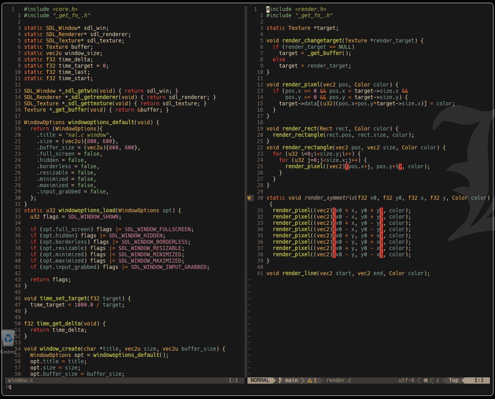
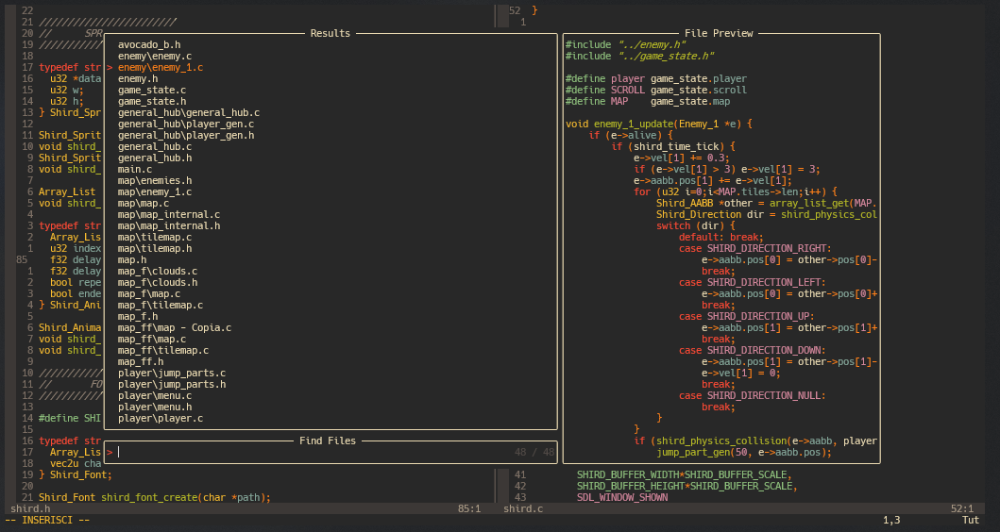

# My neovim config
a *really small* neovim config that i use for coding in c(the chad language)

## Plugins
i used *[packer](https://github.com/wbthomason/packer.nvim)* for plugins
heres a list of the plugins:
- ***[telescope.nvim](https://github.com/nvim-telescope/telescope.nvim)*** *a fuzzy finder*
- ***[nvim treesitter](https://github.com/nvim-treesitter/nvim-treesitter)*** *parser*
- ***[oil.nvim](https://github.com/stevearc/oil.nvim)*** *really cool file explorer* 
- ***[lualine](https://github.com/nvim-lualine/lualine.nvim)*** *idk it looks cool*
- ***[lsp-zero](https://github.com/VonHeikemen/lsp-zero.nvim)*** *lsp stuff*
- ***[mason](https://github.com/williamboman/mason.nvim)*** *lsp stuff pt.2*
- ***[nvim-cmp](https://github.com/hrsh7th/nvim-cmp)*** *completion engine*

## Screenshots

